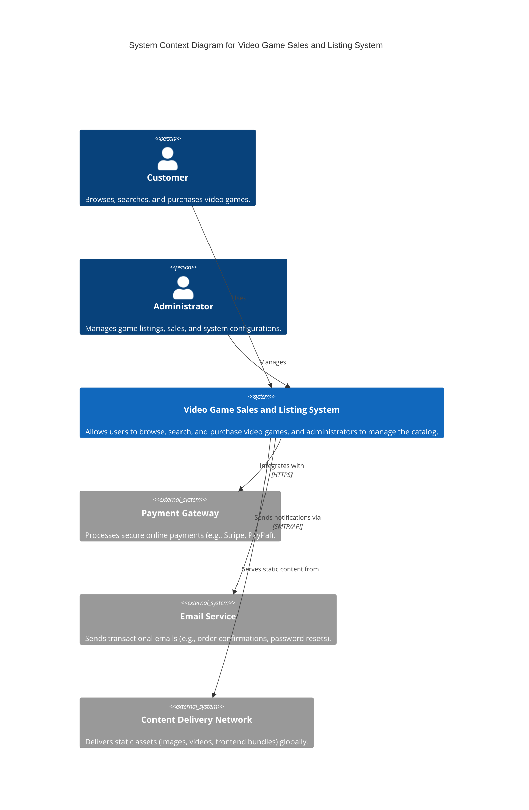

# Video Game Sales and Listing System Architecture

## 1. Introduction

This document outlines the architecture for a high-performance video game sales and listing system. The primary goals are fast API response times and rapid client-side rendering. This will be achieved through a microservices-based backend, a highly optimized frontend, and efficient data storage and caching strategies.

## 2. Architectural Goals

*   **Fast API Response Times:** Minimize latency for all API calls, especially for critical paths like game listings, search, and purchase.
*   **Fast Render Times:** Ensure the user interface loads quickly and remains responsive, providing a smooth user experience.
*   **Scalability:** The system must be able to handle a large number of concurrent users and a growing catalog of games.
*   **Reliability:** High availability and fault tolerance to ensure continuous service.
*   **Maintainability:** Modular design to facilitate easier development, testing, and deployment.

## 3. High-Level System Context (C4 Model - System Context)



## 4. Container Diagram (C4 Model - Container)

```mermaid
C4Container
    title Container Diagram for Video Game Sales and Listing System

    Person(customer, "Customer", "Browses, searches, and purchases video games.")
    Person(admin, "Administrator", "Manages game listings, sales, and system configurations.")

    Container(web_app, "Web Application", "Single Page Application (SPA) built with React/Next.js. Optimized for fast rendering and SEO.", "Browser/CDN")
    Container(api_gateway, "API Gateway", "Routes requests to appropriate microservices, handles authentication/authorization, rate limiting.", "AWS API Gateway / Nginx")
    Container(game_listing_service, "Game Listing Service", "Manages game catalog, search, and metadata. Provides read-optimized APIs.", "Spring Boot / Node.js (FastAPI)")
    Container(order_service, "Order Service", "Handles order creation, processing, and history.", "Spring Boot / Node.js (FastAPI)")
    Container(user_service, "User Service", "Manages user profiles, authentication, and authorization.", "Spring Boot / Node.js (FastAPI)")
    Container(payment_service, "Payment Service", "Orchestrates payment processing with external gateways.", "Spring Boot / Node.js (FastAPI)")
    Container(notification_service, "Notification Service", "Sends emails and other notifications.", "Spring Boot / Node.js (FastAPI)")
    Container(search_service, "Search Service", "Provides fast, full-text search capabilities for games.", "Elasticsearch / OpenSearch")
    Container(caching_layer, "Caching Layer", "Distributed cache for frequently accessed data (e.g., popular game listings).", "Redis / Memcached")
    Container(database, "Database", "Primary data store for transactional data (users, orders, core game data).", "PostgreSQL / MySQL")
    Container(analytics_db, "Analytics Database", "Data warehouse for sales, user behavior, and performance analytics.", "Snowflake / BigQuery")
    Container(message_broker, "Message Broker", "Asynchronous communication between microservices.", "Kafka / RabbitMQ")

    Rel(customer, web_app, "Uses", "HTTPS")
    Rel(web_app, api_gateway, "Makes API calls to", "HTTPS")
    Rel(api_gateway, game_listing_service, "Routes requests to")
    Rel(api_gateway, order_service, "Routes requests to")
    Rel(api_gateway, user_service, "Routes requests to")
    Rel(api_gateway, payment_service, "Routes requests to")
    Rel(api_gateway, notification_service, "Routes requests to")

    Rel(game_listing_service, caching_layer, "Reads/Writes frequently accessed data")
    Rel(game_listing_service, database, "Reads/Writes core game data")
    Rel(game_listing_service, search_service, "Indexes game data for search")

    Rel(order_service, database, "Reads/Writes order data")
    Rel(order_service, message_broker, "Publishes order events")

    Rel(user_service, database, "Reads/Writes user data")

    Rel(payment_service, message_broker, "Consumes payment events")
    Rel(payment_service, payment_gateway, "Integrates with external", "HTTPS")

    Rel(notification_service, message_broker, "Consumes notification events")
    Rel(notification_service, email_service, "Sends emails via", "SMTP/API")

    Rel(search_service, database, "Indexes data from")

    Rel(message_broker, analytics_db, "Streams events to")

    Rel(admin, api_gateway, "Manages via", "HTTPS")
```

## 5. Component Diagram (C4 Model - Component - Example for Game Listing Service)

```mermaid
C4Component
    title Component Diagram for Game Listing Service

    Container(game_listing_service, "Game Listing Service", "Manages game catalog, search, and metadata. Provides read-optimized APIs.", "Spring Boot / Node.js (FastAPI)")

    Component(game_controller, "Game Controller", "Handles incoming HTTP requests for game listings and search.", "REST API")
    Component(game_service, "Game Service", "Business logic for game management, interacts with repositories and search indexer.", "Service Layer")
    Component(game_repository, "Game Repository", "Manages persistence of game data.", "JPA / ORM")
    Component(search_indexer, "Search Indexer", "Pushes game data updates to the search service.", "Event Listener")
    Component(cache_manager, "Cache Manager", "Manages caching of game data.", "Cache Abstraction")

    Rel(game_controller, game_service, "Uses")
    Rel(game_service, game_repository, "Uses")
    Rel(game_service, search_indexer, "Notifies")
    Rel(game_service, cache_manager, "Uses")
    Rel(game_repository, database, "Accesses", "JDBC/ORM")
    Rel(cache_manager, caching_layer, "Interacts with", "Redis Client")
    Rel(search_indexer, search_service, "Updates index in", "REST/Client API")
```

## 6. Technology Choices and Rationale

### Frontend
*   **Framework:** **React/Next.js**
    *   **Rationale:** Next.js provides Server-Side Rendering (SSR) and Static Site Generation (SSG) capabilities, which are crucial for fast initial page loads and excellent SEO. React offers a component-based architecture for building responsive UIs.
*   **Styling:** **Tailwind CSS / Styled Components**
    *   **Rationale:** Tailwind CSS for utility-first rapid styling, or Styled Components for component-scoped CSS, ensuring fast rendering by avoiding global style conflicts and optimizing CSS delivery.
*   **Deployment:** **CDN (e.g., CloudFront, Netlify, Vercel)**
    *   **Rationale:** Distributes static assets globally, reducing latency for users worldwide and improving render times.

### Backend (Microservices)
*   **Language/Framework:** **Spring Boot (Java) / Node.js with Fastify/Express / Python with FastAPI**
    *   **Rationale:**
        *   **Spring Boot:** Mature, robust, and high-performance for building RESTful APIs. Strong ecosystem and community support.
        *   **Node.js (Fastify/Express):** Excellent for I/O-bound operations, highly performant for API services, especially with Fastify for minimal overhead.
        *   **Python (FastAPI):** Modern, high-performance web framework for building APIs with Python 3.7+ based on standard Python type hints.
    *   **Choice depends on team expertise and specific service needs.**
*   **API Gateway:** **AWS API Gateway / Nginx**
    *   **Rationale:** Provides a single entry point for all API requests, handles authentication, authorization, rate limiting, and request routing, offloading these concerns from individual microservices.
*   **Containerization:** **Docker**
    *   **Rationale:** Ensures consistent environments across development, testing, and production. Facilitates easy deployment and scaling.
*   **Orchestration:** **Kubernetes**
    *   **Rationale:** Automates deployment, scaling, and management of containerized applications, ensuring high availability and efficient resource utilization.

### Data Storage & Caching
*   **Primary Database:** **PostgreSQL / MySQL (Relational Database)**
    *   **Rationale:** ACID compliance for transactional data (orders, user accounts). Mature, reliable, and widely supported.
*   **Caching Layer:** **Redis / Memcached**
    *   **Rationale:** In-memory data store for extremely fast retrieval of frequently accessed data (e.g., popular game listings, user sessions). Reduces load on the primary database and significantly improves API response times.
*   **Search Engine:** **Elasticsearch / OpenSearch**
    *   **Rationale:** Provides powerful, fast, and scalable full-text search capabilities for the game catalog. Essential for a responsive search experience.
*   **Analytics Database:** **Snowflake / Google BigQuery (Columnar Data Warehouse)**
    *   **Rationale:** Optimized for analytical queries on large datasets (sales trends, user behavior). Separates analytical workload from transactional database.

### Asynchronous Communication
*   **Message Broker:** **Apache Kafka / RabbitMQ**
    *   **Rationale:** Enables asynchronous communication between microservices, decoupling them and improving overall system responsiveness and resilience. Used for events like order creation, payment status updates, and data synchronization for search indexing.

### Monitoring & Logging
*   **Monitoring:** **Prometheus & Grafana**
    *   **Rationale:** Collects metrics from all services and provides dashboards for real-time system health monitoring.
*   **Logging:** **ELK Stack (Elasticsearch, Logstash, Kibana) / Grafana Loki**
    *   **Rationale:** Centralized logging for easier debugging, troubleshooting, and auditing across distributed services.

## 7. Data Flow and Interactions (Example: Game Listing Retrieval)

1.  **User Request:** Customer accesses the web application (e.g., `/games`).
2.  **Frontend Render:** Web application (Next.js) performs SSR/SSG or client-side fetch.
3.  **API Call:** Web application makes an API call to the API Gateway (e.g., `/api/games`).
4.  **API Gateway:** Authenticates/authorizes the request and routes it to the `Game Listing Service`.
5.  **Game Listing Service:**
    *   Checks `Caching Layer` (Redis) for the requested game listings.
    *   If found, returns data immediately (very fast response).
    *   If not found, queries the `Database` (PostgreSQL) for the data.
    *   Caches the retrieved data in Redis for future requests.
    *   Returns the data to the API Gateway.
6.  **API Gateway:** Returns the response to the Web Application.
7.  **Frontend Render:** Web application renders the game listings, leveraging efficient data fetching and rendering techniques.

## 8. Scalability Considerations

*   **Stateless Microservices:** All microservices are designed to be stateless, allowing for easy horizontal scaling.
*   **Load Balancing:** API Gateway and Kubernetes ingress controllers distribute traffic across multiple instances of microservices.
*   **Database Sharding/Replication:** For very large datasets, the primary database can be sharded or replicated to distribute load and improve read performance.
*   **Caching:** Extensive use of caching at multiple layers (CDN, Redis) to reduce database load and improve response times.
*   **Asynchronous Processing:** Message queues for non-critical operations (e.g., sending notifications) to prevent blocking the main request flow.

## 9. Security Considerations

*   **Authentication & Authorization:** Handled by the API Gateway and User Service (e.g., JWT, OAuth2).
*   **Data Encryption:** Data in transit (HTTPS/TLS) and at rest (database encryption).
*   **Input Validation:** All API inputs are rigorously validated to prevent injection attacks.
*   **Least Privilege:** Services and users are granted only the necessary permissions.
*   **Regular Security Audits:** Periodic security assessments and penetration testing.

## 10. Future Enhancements

*   **Personalized Recommendations:** Integrate a recommendation engine based on user behavior.
*   **Real-time Inventory:** Implement real-time updates for game availability.
*   **User Reviews and Ratings:** Add functionality for users to review and rate games.
*   **Multi-region Deployment:** For global reach and disaster recovery.
